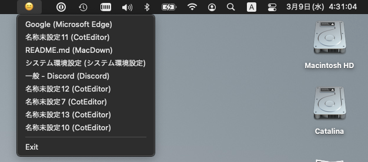

# WindowGate - 別ディスプレイにあるウィンドウを現在のディスプレイに移動する

※Releaseからダウンロードできます。

## 使い方

- アプリを起動
- 画面収録とアクセシビリティを許可する
- メニューから選択
    - 現在のディスプレイにあるウィンドウであれば、最前面に表示
    - 他のディスプレイにあるウィンドウであれば、現在のディスプレイに移動した上で最前面に表示

## 対応

macOS BigSur (11.3) 以上

## ライセンス

MIT